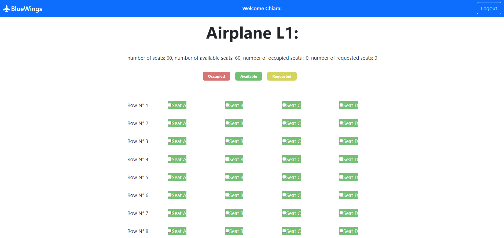
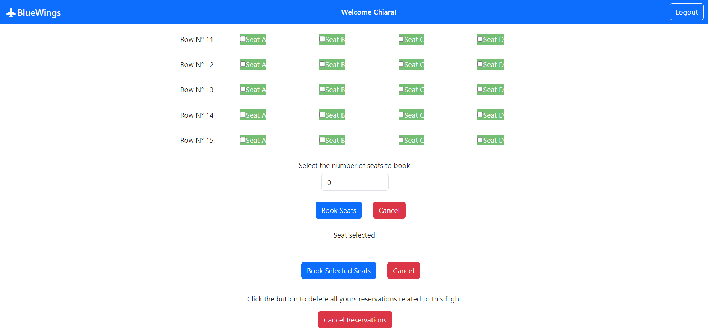

# Exam 2: "Airplane Seats"
## Student: s306273 VAN DER PUTTEN CHIARA

## React Client Application Routes

- Route `/`: main page that show the available airplane and their seats/occupied seats/available seats
- Route `/airplanes/:airplaneId`: shows the seats of the specific airplane (`:airplaneId`) and gives the logged in user the possibility to reserve seats or cancel his reservation
- Route `reservations/:userId`: shows to the specific user (`:userId`) the reservations it has 
- Route `/login`: login page, contains the login form for the authentication
- Route `*`: not found page 

## API Server

- POST `/api/sessions`
  - Performs user authentication by creating a new session.
  - Request body: username and user password
  - Reponse body: returns the info of the user but NOT password or salt

- DELETE `/api/sessions/current`
   - Performs user logout and delete the current user session.
   - Request body: None
   - Response body:  _None_
     
- GET `/api/sessions/current`
   - Gets information about the user, if he is logged in
   - Request body: None
   - Response body: return the id, email and name of the user
     
- GET `/api/airplanes`
   - Returns an array of all the airplanes
   - Request body: None
   - Response body: return the list of airplane objects

- GET `/api/airplanes/:airplaneId`
   - Returns an array of all the seats associated to the airplane with id = `:airplaneId`
   - Request body: None
   - Response body: return the list of seat objects
 
- GET `/api/seats/:userId`
   - returns an array of all the seats associated to the user with id = `:userId` (for the personal page)
   - Request body: None
   - Response body: return the list of seat objects

- POST `/api/makeReservations`
   - Checks that the selected seats are not occupied, if they are occupied it returns the list of seats that create a conflict, otherwise assigning the seats to the user and updating the status of the airplane (occupied seats)
   - Request body : Ids of the seats to booked, the user that make the reservations and the airplane of the reservations
   - Response body : returns the list containing seats that have been booked (successful booking) or the list of seats that have created a conflict (cancelled booking)

- DELETE `/api/cancelAllReservations`
   - Cancels the reservation by going to mark the seats booked by the specific user as free and updates the plane's occupied seats
   - Request body: seat of the deleted reservation and airplane of the reservation
   - Response body : number of lines changed in the db of the seats

## Database Tables

- Table `airplanes` - contains all the airplanes (id of the airplane, type of the airplanes, number of seats, number of occupied seats)
- Table `seats` - contains all the seats of all the airplanes (id of the seat, if the seat is booked, the airplane of the seat, user that booked the seat)
- Table `users` - contains all users info (id of the user, email, password, salt, name)

## Main React Components

- `LoginForm` (in `AuthComponents.jsx`): Component that manages a user's login.
- `AirplaneList` (in `AirplaneListComponent.jsx`): Component that displays all airplanes information and gives the ability to access individual airplanes or your own personal page (if logged in)
- `SingleAirplane` (in `SingleAirplaneComponent.jsx`): Component that shows with a 2D view the seats of the specific airplane and their status. Gives logged-in users the ability to reserve seats through two modalities or cancel reservations made for that airplane
- `ReservationsPage` (in `PersonalPage.jsx`): Show the logged in user his reservations 
-  `FormSelected `,  `FormForRow ` (in  `FormsComponent.jsx`):  Component that manages the two forms for submitting reservations

## Screenshot

## Users Credentials

- chiaravanderputten@gmail.com, ciaociao (with confirmed reservations)
- giulioverdi@gmail.com, baubau (with confirmed reservations)
- mariorossi@gmail.com, miamiao (without confirmed reservation)
- fabiobianchi@gmail.com, mumumu (without confirmed reservation)
